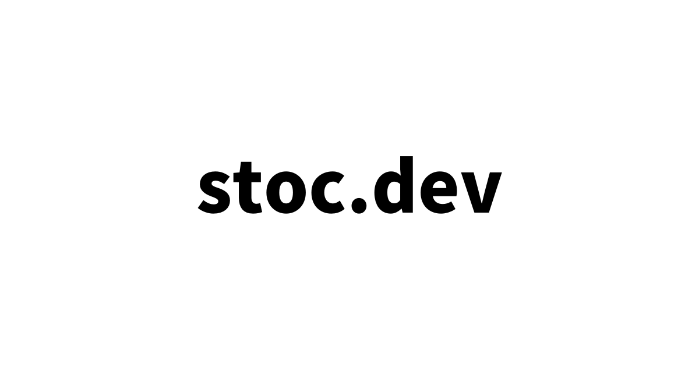

<p align="center">
  <a href="https://stoc.dev" target="_blank" rel="noopener noreferrer">
    
  </a>
</p>
<br/>
<p align="center">
  
  
  
  
  
</p>
<br/>

## 目的

- ウェブ開発の最新情報をシェアする
- 初学者のための学習リソースを提供する
- ウェブ業界の歴史的な資料を蓄積する

## 貢献する準備

```
gh repo clone moekidev/stoc.dev
```

```
cd stoc.dev
```

```
npm i
```

## ドキュメントを追加する

```
npx stoc doc https://example.com/ --tags tag1,tag2
```

もしドキュメントが存在していたらタグをマージします。

## タグを追加する

```
npx stoc tag example-tag "Example Tag" --icon /path/to/image
```

もしタグが存在していたら更新されます。

## サーバー

```
npm run dev
```

## Star History

[](https://star-history.com/#moekidev/stoc.dev)

## コントリビュート

バグ報告やPull-reqはGitHubの https://github.com/moekidev/stoc.dev まで。
このプロジェクトは安全で歓迎される共同作業の場を目指しており、貢献者は[行動規範](https://github.com/moekidev/stoc.dev/blob/main/CODE_OF_CONDUCT.md)を遵守することが期待されています。

## License

このアプリケーションは、[MITライセンス](https://opensource.org/licenses/MIT)の条件の下でオープンソースとして利用可能です

## 行動規範

stoc.dev プロジェクトに関わるすべての人は、[行動規範](https://github.com/moekidev/stoc.dev/blob/main/CODE_OF_CONDUCT.md)に従うことが期待されています。
